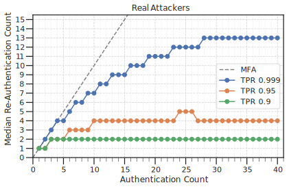
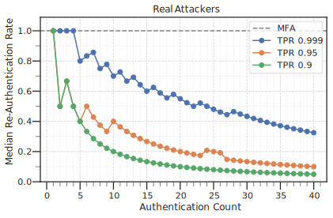
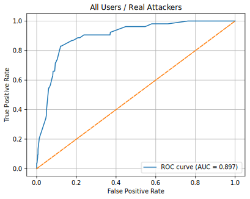
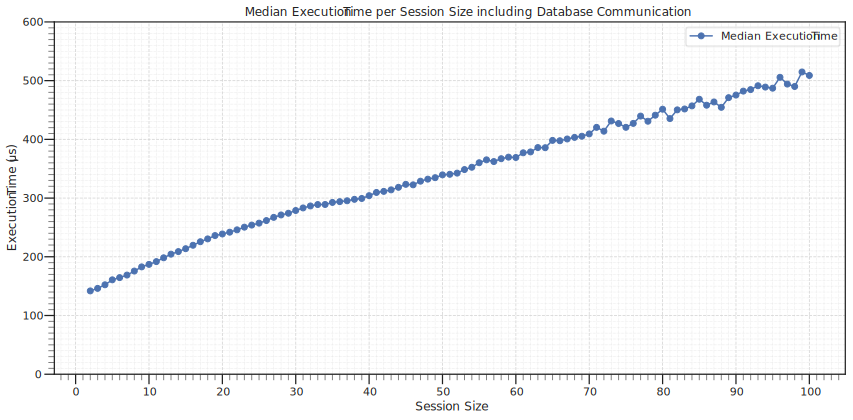

# RBAjs
A deterministic risk-based authentication (RBA) solution. 
I developed this library for the experimental part of my master thesis.
The goal was to write a simple, efficient and transparent solution for risk based authentication.

The library was tested against a public dataset for RBA provided by [Wiefling et al](https://github.com/das-group/rba-dataset).
The following results regarding accuracy and performance were achieved:

<div style="display:flex; gap:10px;">
  
  
</div>




# Usage
To use this library:
1. Configure the [settings](settings.json) to the specific environment.
2. Initialize the `SessionBuilder` (you will need a MaxMind City and ASN Database for that)
3. Supply the current and past login sessions to the `SessionBuilder` from some source. This will most likely be a database of some sort.
4. Initialize the `SessionRiskCalculator`
5. Call the `calculate()` method of the `SessionRiskCalculator` with the current and past login sessions.

The returned object will be of type `LoginSessionRisk` which holds the risk for this login session.
Based on the risk given in this object certain actions may be taken on login:
- Send Notification about unusual login activity
- Prompt user for additional authentication factor
- Submit login activity for human review
- Block login attempt

## Example Database Table
A database table for the use together with this library may look something like this:

```SQL
create table login_sessions (
    id integer primary key,
    user_id bigint not null,
    ip inet not null, 
    asn integer,
    asn_organization text, 
    rtt integer,
    latitude double precision, 
    longitude double precision,
    tmstmp timestamp with time zone not null,
    login_success boolean, 
    is_account_takeover boolean,
    user_agent text,
    browser text, 
    ua_os text,
    browser_major integer, 
    browser_minor integer,
    browser_patch integer, 
    browser_build integer,
    os_major integer, 
    os_minor integer,
    os_patch integer, 
    os_build integer,
    country varchar(10)
);
```
